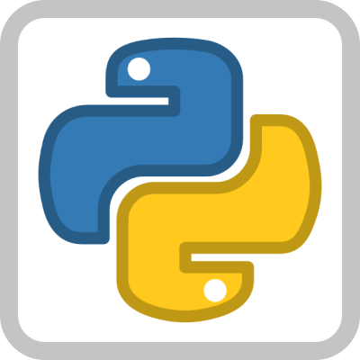

## Hola 👋, soy [Vic](https://vico.dev)

<a href="https://discord.gg/5dSmEzpY">
  
</a>

<a href="https://twitter.com/victor_aguilarc">
  
</a>

<a href="https://www.linkedin.com/in/victoraguilarc/">
  
</a>

<a href="https://www.instagram.com/victor.aguilarc/">
  
</a>

<br /><br />

Hola soy Victor Aguilar soy backend developer y me gusta programar y bailar.


### 👨‍💻🏊‍♂ Actualmente estoy

- Trabajando en ***[Parrot Software](https://parrotsoftware.io)***
- Mentoreando programadores en patreon
- Escribiendo en mi ***[Blog](https://vico.dev)***
- Aprendiendo cosas de devops
- Tomando clases de cosas que me gustan

### 😎 Tecnologías en las que soy bueno

<code></code>
<code></code>
<code></code>
<code></code>
<code></code>
<code></code>
<br/><br/>

### 📊 Tecnologías que más ocupé esta semana

<!--START_SECTION:waka-->

```text
Python             8 hrs 45 mins   ███████▒░░░░░░░░░░░░░░░░░   29.28 %
Dart               7 hrs 22 mins   ██████▒░░░░░░░░░░░░░░░░░░   24.69 %
SQL                5 hrs 59 mins   █████░░░░░░░░░░░░░░░░░░░░   20.04 %
YAML               3 hrs 38 mins   ███░░░░░░░░░░░░░░░░░░░░░░   12.16 %
AUTO_DETECTED      1 hr 49 mins    █▓░░░░░░░░░░░░░░░░░░░░░░░   06.10 %
Text               43 mins         ▓░░░░░░░░░░░░░░░░░░░░░░░░   02.41 %
```

<!--END_SECTION:waka-->

### 📣 Últimos artículos en mi blog

<!--START_SECTION:blog-->
  - [Start here for a quick overview of everything you need to know](https://127.0.0.1:8100/welcome/) - *28 Sep 2021* 
  - [Customizing your brand and design settings](https://127.0.0.1:8100/design/) - *28 Sep 2021* 
  - [Writing and managing content in Ghost, an advanced guide](https://127.0.0.1:8100/write/) - *28 Sep 2021* 
<!--END_SECTION:blog-->